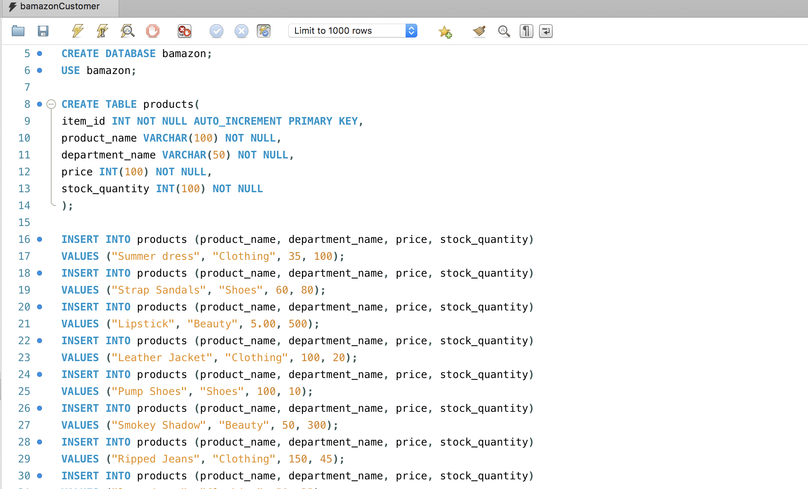

# bamazon
<h1> Creation of Tables </h1>
Create the database and tables on the mysql server

create a Node application called bamazonCustomer.js. Running will display all of the items available for sale. Include the ids, names, and prices of products for sale. The app should then prompt users with two messages.

Through inquirer after selecting the product based on the id you will tell the quantity of item you will like to buy

After selecting the quantity you make the buy and close the program

The database will update with the quantity of product the customer have bought

The video of the program running

